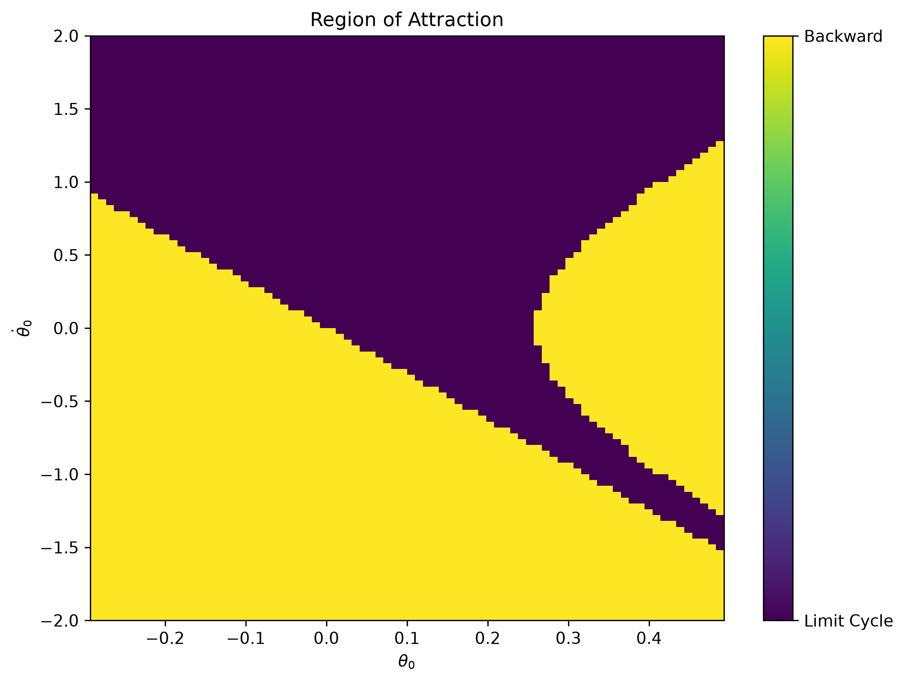
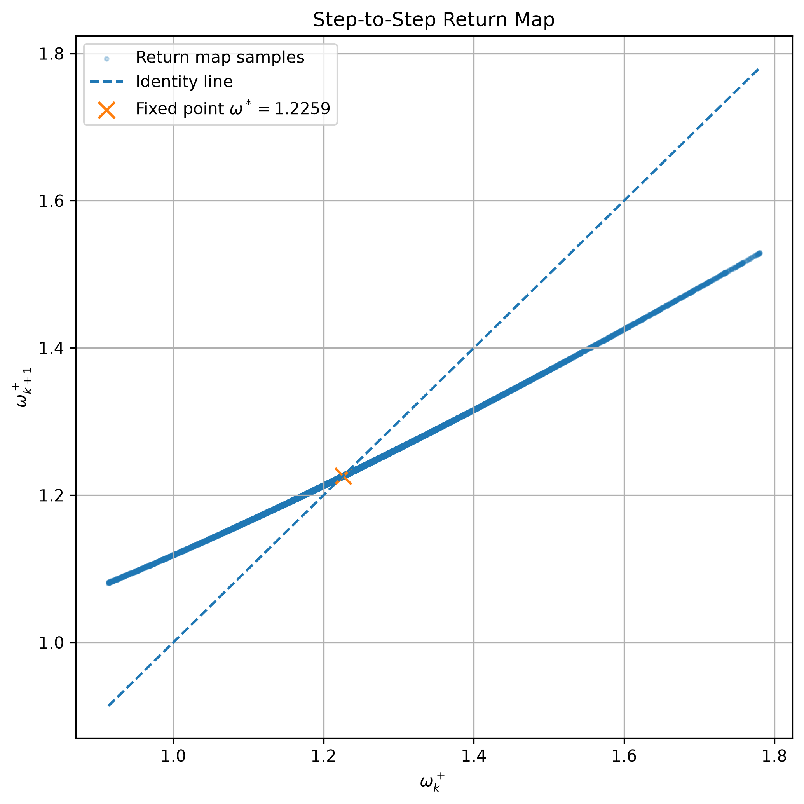
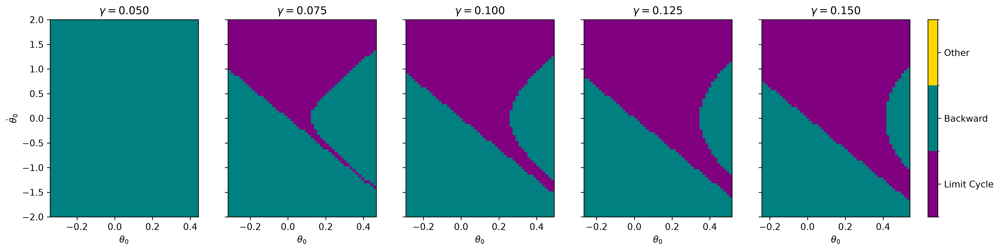
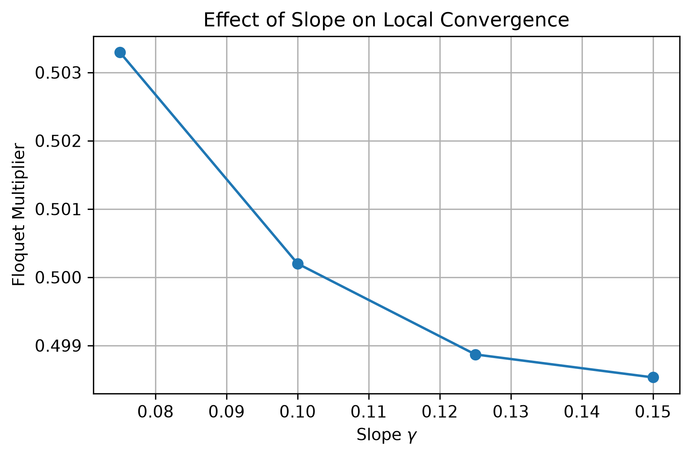
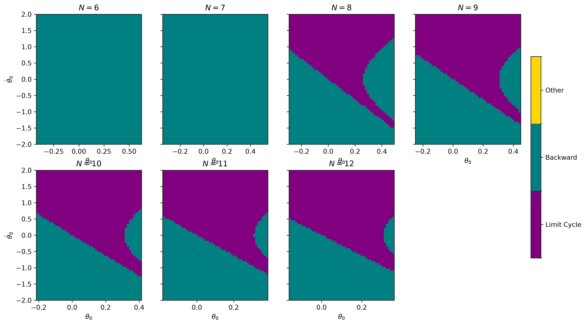
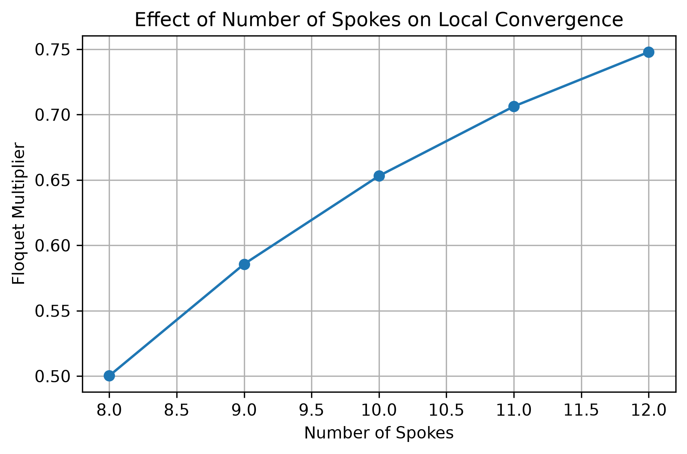

To run the code, please use:

```bash
uv run python assignment_1.py
uv run puthon assignment_1_sweep.py
```

# Sanity Check

- Starting with $(\theta, \dot\theta) = (0, 1)$ and $\gamma = \pi/4, N=8$, we expect to see: (1) At "pendulum" stage, $(\theta, \dot\theta)$ keeps growing; (2) When touching the slope, $(\theta, \dot\theta)$ should be reset from $(\gamma + \alpha, \dot\theta)$ to $(\gamma - \alpha, \dot\theta \cdot \cos(2\alpha))$.

Here we actually see: (1) Satisfied; (2) Before and after collision: $(\theta, \dot\theta) = (0.7069, 2.3876), (-0.0785, 1.6883)$, which satisfies the formula above.

- Starting with $(\theta, \dot\theta) = (-0.1, 1)$ and $\gamma = \pi/4, N=8$, we expect to see the rimless wheel could cross the vertical line.

Here we actually see: $(\theta, \dot\theta)$ cross the vertical, with velocity of $0.9497$.

# State-space Plot of RoA


Set $N=8, /gamma=0.1$, we have the RoA plot above. There are several notes:
- With no friction, we only expect three results here: a limit cycle, backward failure (to simplifu=y, we consider a backward indicates a failure) and an increasing velocity (for example, the slope is big enough for increasing velocity).
- To expedite the simulation, there are two tricks: one is to use rk4 integrator with larger timestep, the other one is to break the loop once we find it converge.
- The definition of converge: we use the velocity right after impact, to see the whether the last 5 ones are with in the tolerance.

# Return-map

Select a window on both sides of the fixed point which is 1.226 rad/s, and the local slope is approximately 0.5.

# Sweep over slope and spokes
## Sweep over slope
We sweep over $\gamma=(0.005, 0.075, 0.1, 0.125, 0.15)$ with a fixed spoke $N=8$. The figures below shows that: 
- As slope increases, the area of RoA increases. And we also see that when the slope is very samll, the limit cycle does not exist. An explanation for this is: the impacts cost energy more than gravity gained, then the rimless wheel would stop on the slope.
- As slope increases, the $\lambda$ would decrease a little. But theoretically, $\lambda$ measures how fast the angular velocity would converge, the bigger $\lambda$, the slower convergence. In our model, the convergence relies only on $\alpha$. Therefore, slope should not influence the convergence, it is likely a numerical volatility.





## Sweep over spokes
We sweep over 6-12 with a fixed $/gamma=0.1$.
- As number of spokes increases, the area of RoA increases. When the number is 6 or 7, the limit cycle does not exist. The explanation would be the same as above: the impacts cost too much energy $(\cos(2\alpha))$ compared with gained from potential energy. Then the wheel would never enter the limit cycle.
- As number of spokes increases, the $\lambda$ increases. The explanation is: when $N$ goes up, the $\alpha$ would goes down, and $\cos(2\alpha)$ goes up, indicating every impact would have less effect in angular velocity, so $\lambda$ would be bigger.





